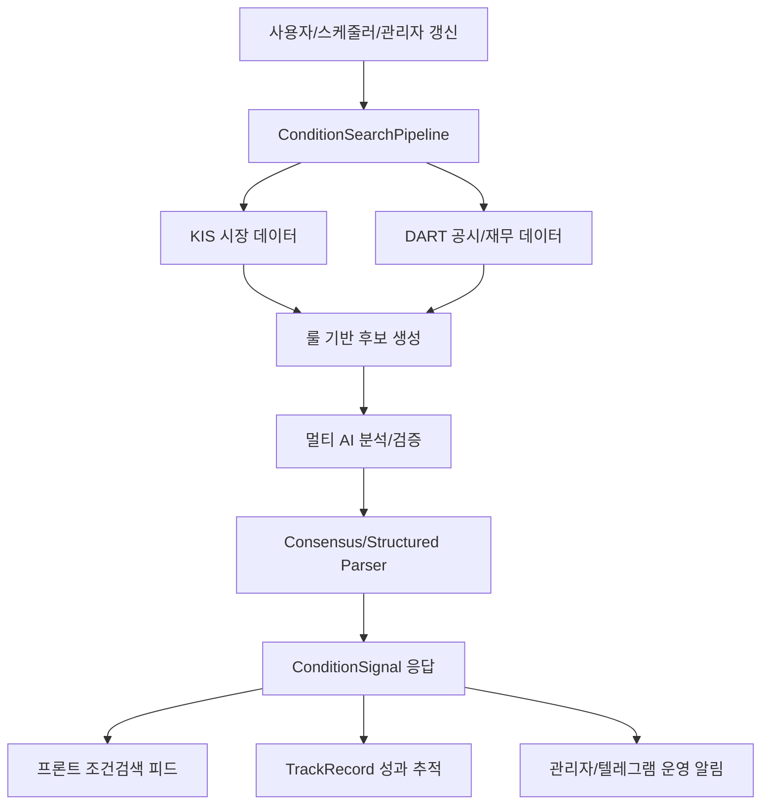

# AI 에이전트 조건검색기 시스템 앱 구조설계 최종 보고서

작성일: 2026-06-07 KST
총괄 팀장 기준 저장소: `C:\bitman_justbuy_project`
요청 시작 폴더: `C:\조건검색기 알파오메가`

## 1. 총괄 결론

현재 `C:\조건검색기 알파오메가`에는 실제 앱 코드가 거의 없고 비밀키 관련 파일만 확인되었다. 비밀키 파일은 열람하지 않았으며, 실제 BitMan/조건검색 앱 코드는 `C:\bitman_justbuy_project`로 확정한다.

시스템은 이미 다음 골격을 갖고 있다.

- 프론트엔드: Vite + React + React Router 기반 SPA
- 백엔드: Spring Boot 3.4.x + Java 21 + Spring Security/JPA/Caffeine
- 도메인: PRO 구독자 전용 조건검색, 관리자 승인/설정/갱신, KIS/DART/DeepSeek/멀티 AI 분석
- 운영: MiniPC 홈서버 배포, Spring Boot가 정적 프론트까지 함께 서빙
- 조건검색 핵심 모드: `BREAKOUT`, `REVERSAL_EDGE`, `FLOW_LEADER`, `CATALYST_BURST`, `CLOSING_BET`, `ALERTS`

최종 설계 방향은 "기존 단일 Spring Boot + Vite 앱을 유지하되, 조건검색 엔진을 데이터 수집, 룰 점수화, AI 검증, 결과 저장, 성과 추적의 5단계 파이프라인으로 명확히 분리"하는 것이다. AI는 매수/매도 확정자가 아니라 증거 검증 및 설명 보조자로 제한한다.

## 2. 팀 구성 및 스레드

총괄 팀장: 현재 스레드

- 프론트엔드 설계 팀: `019ea067-18fc-7b92-b8a1-223e59838b06`
- 백엔드/API 설계 팀: `019ea067-2a51-7b13-9ed5-2e37a1918d3d`
- AI 에이전트/워크플로우 설계 팀: `019ea067-341f-7740-bab7-2b76db568f39`

각 팀은 독립 스레드로 생성되었고, 기준 저장소가 `C:\bitman_justbuy_project`임을 다시 지시했다. 모든 팀에 `.env`, API 키, 토큰, DB 원본, 운영 데이터 열람 금지를 명시했다.

## 3. 현재 구조 요약

### 3.1 프론트엔드

주요 파일:

- `frontend/src/main.tsx`: 라우팅, 인증 컨텍스트, 서비스 워커 등록
- `frontend/src/layouts/AppLayout.tsx`: 앱 레이아웃, 조건검색 feed 폴링, 알림 이벤트
- `frontend/src/pages/HomePage.tsx`: 메인 조건검색 화면, 30초 폴링, 섹션별 신호 표시
- `frontend/src/api/conditionApi.ts`: `/api/main`, `/api/conditions/{section}`, capture-times 계약
- `frontend/src/api/analysisApi.ts`: `/api/analysis/live`, `/api/analysis/job/{jobId}` 비동기 분석 계약
- `frontend/src/hooks/useMainConditions.ts`: 메인 조건검색 데이터 로딩/폴링

현재 라우트는 공개 영역 `landing/register/login`, 로그인 필요 영역 `subscribe`, PRO 구독 필요 영역 `/`, `/supply`, `/my`, `/admin`으로 나뉜다. 홈 화면은 `short-term`, `swing`, `leaders`, `themes`, `closing-bet`, `alerts`를 하나의 조건검색 피드로 렌더링한다.

### 3.2 백엔드/API

주요 파일:

- `backend/src/main/java/com/bitman/justbuy/controller/ConditionController.java`: `/api/main`, `/api/conditions/*`
- `backend/src/main/java/com/bitman/justbuy/controller/AnalysisController.java`: `/api/analysis/*`, live job
- `backend/src/main/java/com/bitman/justbuy/service/MainConditionService.java`: 메인 피드 조합, sourceStatus, capture time
- `backend/src/main/java/com/bitman/justbuy/service/ConditionSearchPipeline.java`: 기존 분석 서비스와 조건검색 계약 사이의 파사드
- `backend/src/main/java/com/bitman/justbuy/service/ConditionSearchFormulaCatalog.java`: 4대 핵심 조건식 카탈로그
- `backend/src/main/java/com/bitman/justbuy/service/AsyncJobManager.java`: 비동기 분석 job 상태와 TTL
- `backend/src/main/java/com/bitman/justbuy/service/PrecomputeScheduler.java`: 거래일 스케줄링, 프리컴퓨트, 텔레그램 발송
- `backend/src/main/java/com/bitman/justbuy/ai/MultiAgentOrchestrator.java`: ChatGPT/DeepSeek/Grok/Gemini 조합, 합의 및 성과 기록
- `backend/src/main/java/com/bitman/justbuy/security/SecurityConfig.java`: JWT 기반 stateless API 보호

현재 API는 PRO 구독 검사를 컨트롤러 단위로 반복하고 있다. 설계 확정안에서는 이를 공통 guard/service 또는 annotation 기반 정책으로 모으는 것이 좋다.

### 3.3 AI/워크플로우

현재 워크플로우는 다음 형태다.

AI 레이어는 `AiAgent` 인터페이스와 OpenAI-compatible 호출 구조를 기반으로 한다. DeepSeek 설정은 런타임 저장/마스킹 구조가 있으며, 관리자 화면에서 테스트와 갱신을 수행할 수 있다.

## 4. 확정 아키텍처

### 4.1 프론트엔드 확정안

프론트는 지금의 React/Vite SPA 구조를 유지한다. 단, `HomePage`에 조건검색 표시/데이터 변환/상태 표시가 많이 몰려 있으므로 다음으로 분리한다.

- `features/conditions/api`: `conditionApi.ts` 유지, 응답 타입 확장
- `features/conditions/hooks`: `useMainConditions`, `useConditionSection`, `useConditionCaptureTimes`
- `features/conditions/components`: `ConditionSectionCard`, `SignalTable`, `SourceStatusBadge`, `CaptureTimeBadge`
- `features/analysis`: live analysis job polling과 결과 overlay
- `features/admin-condition`: 관리자 수동 refresh, formula version, run history

상태관리 원칙:

- 인증/구독: 현재 `AuthContext` 유지
- 서버 상태: 조건검색/성과/분석 job은 fetch hook 단위로 관리하되, 중복 폴링을 줄이기 위해 공통 cache key와 stale policy를 둔다.
- 실시간성: 현재 30초/60초 폴링 유지. 장중 실시간 스캔이 안정화되면 SSE 또는 WebSocket은 2단계에서 검토한다.
- UX: `sourceStatus`를 사용자 언어로 고정 매핑한다. 예: `REALTIME_SCAN`, `PRECOMPUTED`, `STALE_CACHE`, `DATA_UNAVAILABLE`.

필수 화면:

- 메인: 6개 조건검색 섹션, TOP3, 포착 시각, 위험 플래그, 무효화 조건
- 섹션 상세: 후보 전체, 필터, 정렬, capture-time timeline
- 성과: 단타 종가 검증, 스윙 누적 성과
- 관리자: 조건식 실행 상태, KIS/DART/DeepSeek 상태, 수동 갱신, API 테스트, formula version

### 4.2 백엔드/API 확정안

백엔드는 현재 Spring Boot 단일 앱을 유지한다. 신규 마이크로서비스 분리는 지금 단계에서는 과하다. 대신 패키지 경계를 명확히 한다.

권장 패키지:

- `condition.catalog`: 조건식 정의와 버전
- `condition.collector`: KIS/DART/시장 데이터 후보 수집
- `condition.rule`: 룰 점수, 리스크 필터, 제외 사유
- `condition.ai`: EvidencePacket, verifier, parser
- `condition.run`: 실행 이력, 상태, job/event
- `condition.signal`: 최종 신호 저장/조회
- `condition.performance`: 성과 추적

확정 API:

- `GET /api/main`: 메인 피드. 현재 유지.
- `GET /api/conditions/{section}`: 섹션 상세. 현재 유지.
- `GET /api/conditions/capture-times`: 포착 시각 통합. 현재 유지.
- `GET /api/analysis/pipeline`: 조건검색 카탈로그/캐시 상태. 현재 유지.
- `POST /api/analysis/live`: 사용자 live 분석 job 생성. 현재 유지.
- `GET /api/analysis/job/{jobId}`: job 상태/결과. 현재 유지.
- `POST /api/admin/conditions/{section}/refresh`: 섹션 수동 갱신. 신규/확장.
- `GET /api/admin/conditions/runs`: 실행 이력. 신규/확장.
- `GET /api/admin/conditions/formulas`: formula version 조회. 신규.
- `PATCH /api/admin/conditions/formulas/{section}`: 조건식 임계값/프롬프트 버전 조정. 신규.

응답 계약은 `sourceStatus`, `asOf`, `capturedAt`, `riskFlags`, `invalidation`, `ruleScore`, `aiScore`, `finalScore`를 프론트와 고정한다.

### 4.3 데이터 모델 확정안

현재 `AnalysisTrackRecord`는 유지한다. 조건검색 전용 저장 모델은 다음을 추가한다.

- `ConditionRun`: section, formulaVersion, status, candidateCount, signalCount, durationMs, sourceStatusJson, error, startedAt, finishedAt
- `ConditionCandidate`: section, stockCode, stockName, sourceSnapshotJson, ruleScore, exclusionReasons, evidenceHash
- `ConditionSignal`: section, mode, stockCode, stockName, rank, capturePrice, currentPrice, highAfterCapture, maxReturnPct, status, ruleScore, aiScore, finalScore, summary, evidenceJson, riskFlagsJson, invalidation, capturedAt
- `ConditionFormulaVersion`: section, version, enabled, ruleConfigJson, promptVersion, modelProfile, createdBy, createdAt

H2는 개발/홈서버 초기 운영에 유지하되, 운영 트래픽과 성과 데이터가 누적되면 PostgreSQL 전환을 계획한다.

### 4.4 AI 에이전트/워크플로우 확정안

AI는 "생성"보다 "검증/요약"에 둔다.

에이전트 역할:

- Data Collector: KIS/DART 데이터 수집. AI 사용 금지.
- Rule Scorer: 수치 기반 후보 20~50개 산출. AI 사용 금지.
- Evidence Verifier: DeepSeek/ChatGPT가 EvidencePacket만 보고 JSON verdict 산출.
- Risk Explainer: 위험 플래그와 무효화 조건을 사용자 문장으로 정리.
- Consensus/Synthesis: 복수 모델 결과 충돌을 조정하되, 데이터에 없는 종목/가격 생성 금지.
- Human Supervisor: 관리자 수동 갱신, formula version 변경, DeepSeek 설정 테스트.

핵심 단계:

1. 스케줄러 또는 관리자 요청으로 `ConditionRun` 생성
2. KIS/DART 어댑터가 후보 스냅샷 생성
3. 룰 엔진이 점수화하고 제외 사유 기록
4. EvidencePacket hash 생성 후 AI 검증 요청
5. JSON schema 검증, 파싱 실패 시 rule-only fallback
6. TOP 신호 저장 및 `/api/main` 캐시 갱신
7. 장마감/일별 성과 추적 업데이트

안전장치:

- LLM은 외부 API를 직접 호출하지 않는다. 백엔드가 만든 EvidencePacket만 입력한다.
- "매수 확정", "수익 보장", "손실 보전" 표현 금지.
- 모든 가격/수급/공시 근거는 출처 필드와 시각을 가진다.
- AI output은 JSON schema 검증 후만 저장한다.
- 불확실하거나 데이터가 없으면 `DATA_UNAVAILABLE`, `WATCH`, `REJECT`로 내려준다.

## 5. 구현 우선순위

Phase 1: 계약 고정

- `ConditionSignalDto`와 프론트 타입을 최종 필드로 고정
- sourceStatus enum 문서화
- API 에러 메시지/권한 오류 메시지 표준화

Phase 2: 조건검색 실행 이력

- `ConditionRun`, `ConditionSignal`, `ConditionFormulaVersion` 추가
- 관리자 run history API 추가
- 스케줄러 실행마다 run id 기록

Phase 3: 후보 수집/룰 엔진 분리

- `ConditionCandidateCollector`
- `ConditionRuleEngine`
- `ConditionRiskFilter`
- 섹션별 collector: short-term, swing, leaders, themes, closing-bet

Phase 4: AI 검증 구조화

- `EvidencePacket`
- `DeepSeekConditionVerifier`
- JSON schema/parser
- 검증 실패 fallback 및 실패율 모니터링

Phase 5: 프론트 기능 분리

- 조건검색 feature 폴더 도입
- 섹션 카드/상세/성과/관리자 패널 분리
- polling 중복 제거

Phase 6: 운영 검증

- `backend`에서 `.\gradlew.bat test`
- `frontend`에서 `npm run build`
- 로컬 브라우저 smoke test
- MiniPC 배포 전 DB 백업 및 health check

## 6. 리스크 및 결정 사항

### 리스크

- 현재 요청 폴더와 실제 앱 저장소가 다르다. 작업 시작 시 항상 기준 루트를 확인해야 한다.
- 작업트리에 이미 수정/미추적 파일이 많다. 구현 단계에서는 범위를 먼저 고정해야 한다.
- 일부 Korean UI 문자열이 터미널에서 깨져 보인다. 실제 파일 인코딩과 브라우저 표시를 별도로 확인해야 한다.
- `SecurityConfig`에 SPA 경로 permitAll과 API 인증 정책이 섞여 있다. API 보호 정책은 별도 테스트가 필요하다.
- live analysis job은 인메모리 TTL이므로 서버 재시작 시 job 상태가 사라진다.
- AI 검증 결과가 JSON schema 없이 자유 텍스트에 의존하면 파싱 실패와 hallucination 리스크가 커진다.

### 결정 필요

- 운영 DB를 H2로 계속 둘지, PostgreSQL 전환 시점을 정할지
- 조건검색 결과를 파일 캐시 중심으로 유지할지, DB 중심으로 전환할지
- 실시간 UI를 폴링으로 유지할지, SSE/WebSocket으로 전환할지
- DeepSeek를 최종 검증 전용으로 둘지, ChatGPT/Grok과 병렬 합의 구조를 계속 유지할지
- 유사투자자문/광고/면책 문구를 서비스 약관과 UI 어디에 고정할지

## 7. 참고 출처

- KIS Open API sample repository: https://github.com/koreainvestment/open-trading-api
- KIS Developers: https://apiportal.koreainvestment.com/provider-doc2
- OpenDART 공시검색 `list.json`: https://opendart.fss.or.kr/guide/detail.do?apiGrpCd=DS001&apiId=2019001
- OpenDART 고유번호 `corpCode.xml`: https://opendart.fss.or.kr/guide/detail.do?apiGrpCd=DS001&apiId=2019018
- DeepSeek Chat Completion API: https://api-docs.deepseek.com/api/create-chat-completion
- DeepSeek Models & Pricing: https://api-docs.deepseek.com/quick_start/pricing
- OpenAI Agents SDK guide: https://platform.openai.com/docs/guides/agents-sdk
- OpenAI Agents SDK tracing: https://openai.github.io/openai-agents-js/guides/tracing
- OpenAI Agent evals: https://platform.openai.com/docs/guides/agent-evals
- Spring Boot task execution and scheduling: https://docs.spring.io/spring-boot/3.4.6/reference/features/task-execution-and-scheduling.html
- Vite production build: https://vite.dev/guide/build.html
- 자본시장법 제101조 유사투자자문업 신고: https://www.law.go.kr/LSW/lsSideInfoP.do?docCls=jo&joBrNo=00&joNo=0101&lsiSeq=273695&urlMode=lsScJoRltInfoR
